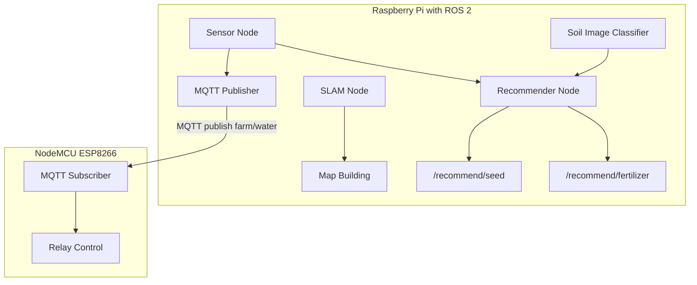

# 📡 Project Architecture Schema – AI-Based Farm Robot

This diagram shows the overall architecture of the AI robot system.

## Components Overview

1. **ROS 2 Robot (Raspberry Pi)**
   - SLAM Navigation (Nav2 + LiDAR or depth camera)
   - Sensor Readers (NPK, moisture, temperature)
   - Camera (image capture for soil type classification)
   - Recommender Node (seed + fertilizer decision)
   - MQTT Publisher Node (sends water commands)

2. **NodeMCU ESP8266**
   - Listens to MQTT topic `farm/water`
   - Controls relay to switch water pump ON/OFF

---

## Data Flow Diagram

---

## Communication Summary

| Source           | Destination     | Protocol | Topic / Data            |
|------------------|-----------------|----------|--------------------------|
| Sensor Node      | Recommender     | ROS 2    | `/sensor/moisture`, etc |
| Camera Node      | Recommender     | ROS 2    | `sensor_msgs/Image`     |
| Recommender      | ROS 2 Topic     | ROS 2    | `/recommend/seed`       |
| Recommender      | ROS 2 Topic     | ROS 2    | `/recommend/fertilizer` |
| PumpController   | MQTT Broker     | MQTT     | `farm/water`            |
| ESP8266 (NodeMCU)| Relay           | GPIO     | HIGH / LOW              |

---

## Configuration Files

- `configs/soil_thresholds.yaml`: Moisture levels, NPK criteria
- `src/pump_ctrl/mqtt_publisher.py`: Sends watering commands to ESP via MQTT

---

## Cloud Dashboard (optional)
- Use MQTT + Node-RED or ThingsBoard to build a live dashboard of farm activity.

